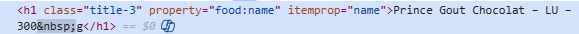
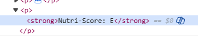
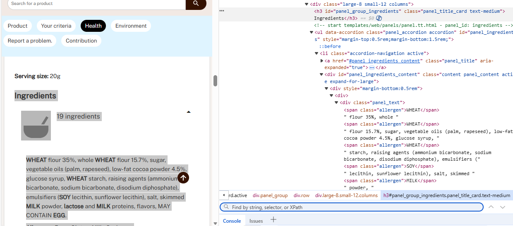
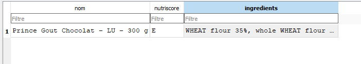
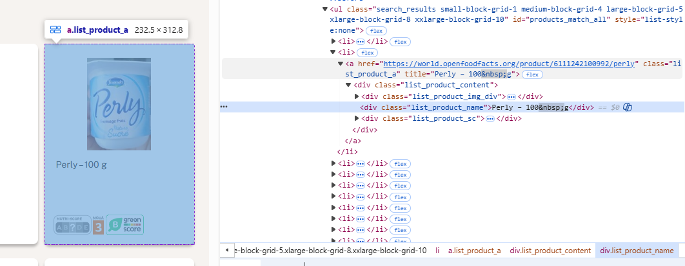

On commence par essayer d'afficher un produit d'abord:

Pour le nom:
on regarde avec inspecter ce qu'il faut récupérer :

avec h1, on récupère 

<h1 class="title-3" itemprop="name" property="food:name">Thai peanut noodle kit includes stir-fry rice noodles &amp; thai peanut seasoning – Simply Asia – 155 g</h1>

--> ici on a récupéré la balise et pas le texte 
on rajoute :

    nom= soup.find("h1")
    nom_produit = nom.get_text(strip=True)  if nom else None # nécéssaire sinon retourne la balise HTML et pas le texte 

ensuite pour récupérer le nutriscore
il y a d'autres textes avec la balise <strong> donc on précise qu'on récupère le texte avec Nutri-Score

on a donc écrit 

nutri = soup.find("strong", text=lambda t: t and "Nutri-Score" in t) # on cherche avec inspecter
nutriscore = nutri.text.replace("Nutri-Score:", "").strip() if nutri else None

la deuxième ligne est indispensable car certains produits n'ont pas de nutriscore 

Pour les ingrédients il a fallu procédé différemment car récupérer simplement h4 nous donnait d'autres textes avant. Le repère le plus précis que j'ai trouvé pour que python le reconnaisse c'est l'image qu'on a avant 

d'où

    ingr = soup.find("h3", id="panel_group_ingredients").find_next("div", class_="panel_text") # pareil, necessaire car pas assez précis juste "ingrédients"
    ingredients = ingr.get_text(" ", strip=True) if ingr else "Sans ingrédients"

Ensuite on essaie de ranger cette donnée dans la database :
on passe sur le fichier python database:
il faut creer la table, les colonnes et creer une fonction qui ajoute,à partir du dictionnaire renvoyé par le programme scraper, les données sur la table :
le programme est annoté :
''' python
import sqlite3            # pour travailler avec SQLite # pour enregistrer la date du scraping

class DatabaseManager:
    def __init__(self, db_path="database.db"):
        # Connexion à la base SQLite (une seule fois)
        self.conn = sqlite3.connect(db_path)
        self.cursor = self.conn.cursor()
        # On crée la table si elle n'existait pas avant
        self.creer_table()

    # database.py
    def recup_prod(self):
        self.cursor.execute("SELECT * FROM produits") # avec self.cursor.execute : on parle en SQL
        return self.cursor.fetchall()

    def creer_table(self):
        # on crée la table ( 1ère utilisation avec les colonnes nom, nutri-score, ingrédients, date)
        
        self.cursor.execute("""
        CREATE TABLE IF NOT EXISTS produits (
            nom TEXT NOT NULL,
            nutriscore TEXT,
            ingredients TEXT
        )
        """)

        self.conn.commit()  # on sauvegarde la création de la table

    def insert_produit(self, nom, nutriscore, ingredients):
        # Insertion immédiate d'un produit
        try:
            self.cursor.execute("""
                INSERT INTO produits (
                     nom, nutriscore, ingredients
                ) VALUES (?, ?, ?)
            """, (
                nom,                        
                nutriscore,                
                ingredients))                 
            self.conn.commit()  # on sauvegarde l'ajout du noveau produit
        except sqlite3.IntegrityError:
            # pour éviter les doublons
            pass

    def close(self):
        #Fermeture propre de la base
        self.conn.close()
'''

On a notre classe crée, il faut maintenant revenir dans le fichier scraper pour utiliser ces nouvelles fonctions :
on rajoute :
 

from database import Database
'''On exporte les données sur le fichier SQL'''
db = Database("data/database.db")  # ouvre la base
product = scraper(URL) # On récupère toutes les infos
db.insert_produit(nom=product["nom"], nutriscore=product["nutriscore"], ingredients=product["ingredients"]
)
print("nouvelle ligne: " , db.recup_prod())
db.close()  # fermeture propre

on a maintenant, dans notre dossier 

Maintenant il faut réusir à ajouter plusieurs produits
On ne part plus de la page d'un produit mais depuis la page d'accueil 

On remarque l'url de la page d'un produit :

ce qui nous interesse : 

<a href="https://world.openfoodfacts.org/product/6111242100992/perly" class="list_product_a" title="Perly – 100&nbsp;g">

donc les liens sont dans des balsises  <a href="">, il faut récupérer tous les liens de produits, on peut donc vérifier qu'il y a bien la partie /product/ dans le lien ( il y a d'autres liens sur la page)

En fait, on récupère sous format Java Script, il faut passer par Selenium:
        driver = webdriver.Chrome()   # ouvre Chrome
        driver.get(URL)  # page d'accueil
        time.sleep(5)  # attendre que le JS charge
        produits = driver.find_elements(By.CLASS_NAME, "list_product_a")

        for p in produits:
            lien = p.get_attribute("href")
            liens.append(lien)

On écrit une fonction qui récupère une liste de lien, une fonction qui ajoute pour chaque element de la liste le nouveau produit . 
ca marche ! on peut maintenant passer à l'analyse des données

Déjà je commence par récupérer toutes les données : je créee une fonction get_all_produits qui me renvoie une liste de tuples, 
on utilise la librairy panda pour faire des statistiques 